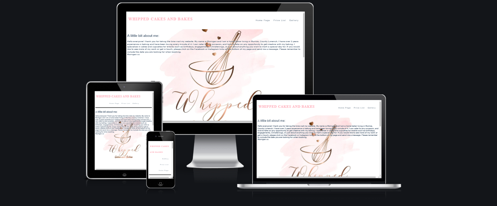
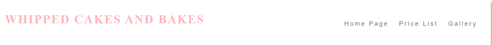
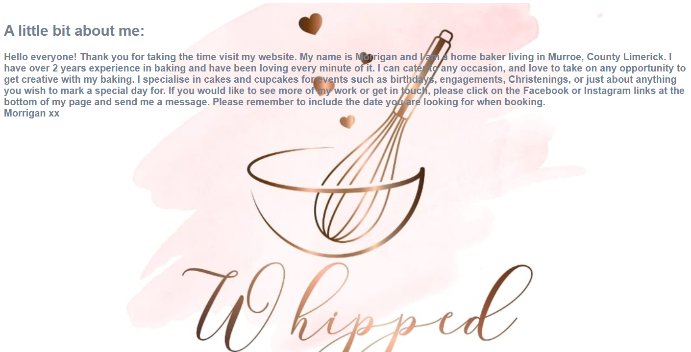
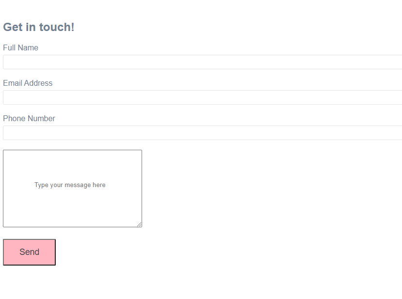
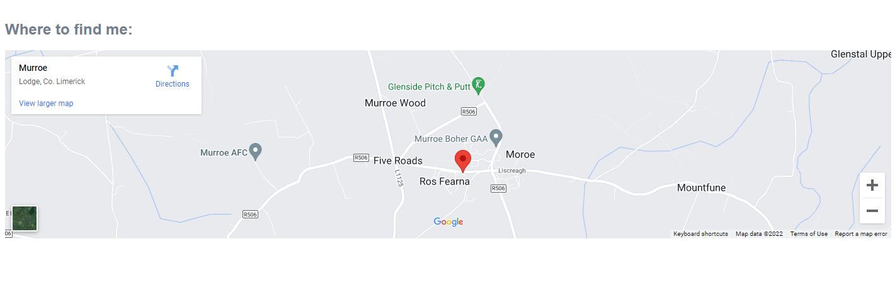
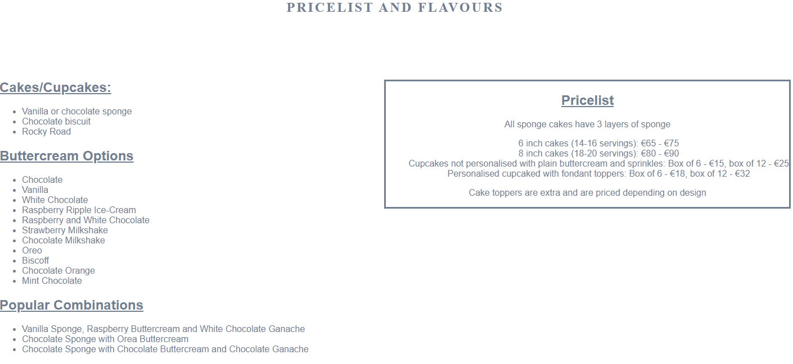
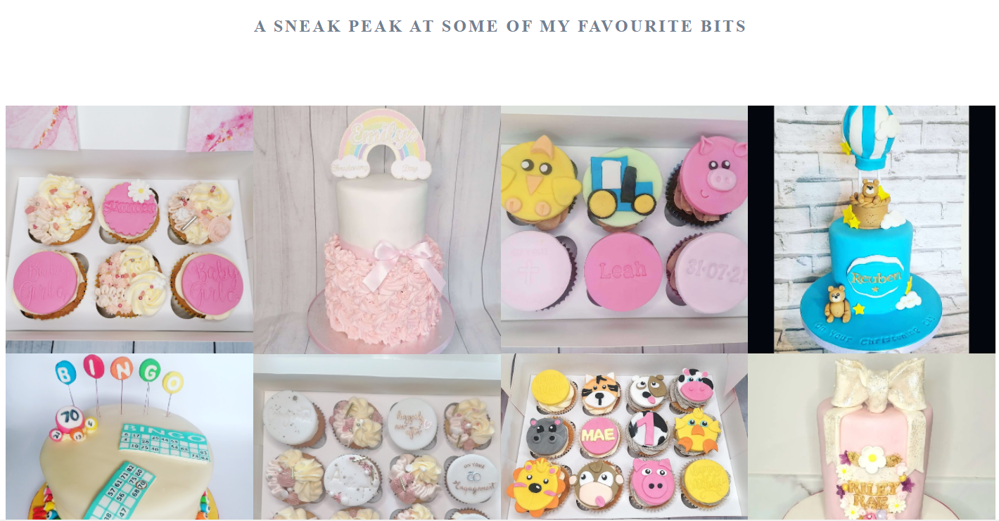
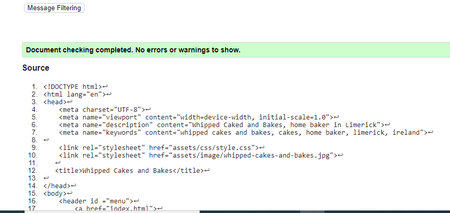
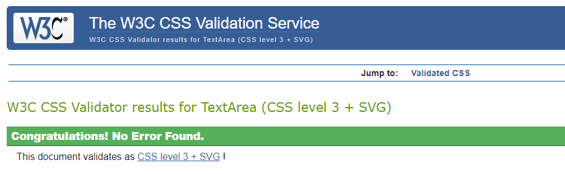
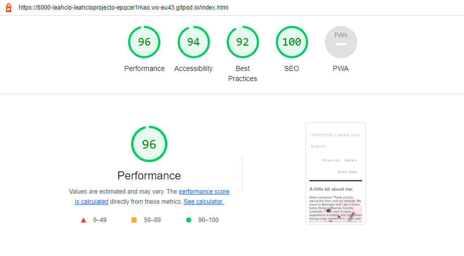

# Whipped Cakes and Bakes

The Whipped Cakes and Bakes website was created for a dear friend of mine, Morrigan. The purpose of this website is to provide an additional source for her to showcase her work, promote her social media pages and to allow customers to get in touch.

Users of this website will be able to view prices, flavours of cakes, view photos of some of the work done at Whipped Cakes and Bakes, access links to social media and get in touch directly using the form section.

## Features

- ### Navigation
At the top of the page, we can find the business name in the left hand corner. To the right of this, the user will find the navigation links Home Page, Price List and Gallery.

### About Me Section
This section provides a brief introduction to Morrigan, to the type of service she provides and the types of events that she caters for. It offers the user some useful information on how they can get in touch if they wish to place an order with Whipped Cakes and Bakes. This sections also contains a background image of the Whipped Cakes and Bakes company logo.

### Form Section
The form section allows the user to input their name, email address and write a message.

### Map Section
The map section provides the user with a Google Maps location on where the business is run from. It can allow the user the opportunity to get directions should they be collecting their orders. There is also an option to click on the map image and view the map larger.

### Price List Page

This page provides the user with all of the information they may need in terms of the types of bakes goods which can be purchased, flavours and popular combinations, and probably most important of all, the cost.

### Gallery Page

The gallery page offers the user visuals on the work done at Whipped Cakes and Bakes. It gives the user an idea of the styles of cakes and cupcakes and really showcases the amazing work done by Morrigan.

### Footer Section

The footer section provides links to the Whipped Cakes and Bakes Instagram and Facebook pages. This footer is carried among the 3 pages on the website and so the social media pages can be quickly accessed by the user.

## Testing

I tesed this website using different browsers such as Chrome and Internet Explorer. I have confirmed that the social media links and navigation sections are all working appropriately. I have also confirmed that the form works.

### Validator Testing

- HTML: An initial error was found on a Stray End Tag but this was then resolved and no further warnings or errors were found. For testing, I used The W3C HTML Validator.

- CSS: No errors were found on CSS testing. For testing, I used The W3C CSS Validator.

- Accessibility: I confirmed accessibility by running this through lighthouse on devtools.

### Deployment

The site was deployed by implementing the following steps: 

- Navigate to the Settings tab on Github and find the Pages section
- On the source section dropdown, select Main
- Once this has been selected, the link for the deployed site will appear after just a few moments

### Credits

## Media

The credits for all of the images used have been sourced from the Whipped Cakes and Bakes [Facebook](https://www.facebook.com/Whippedcakesandbakes1/) and [Instagram](https://instaram.com/whipped_cakesandbakes/) pages.

## Content

A source I found helpful in assisting me in coding some of my content was [w3schools](https://www.w3schools.com/html/html_examples.asp)

